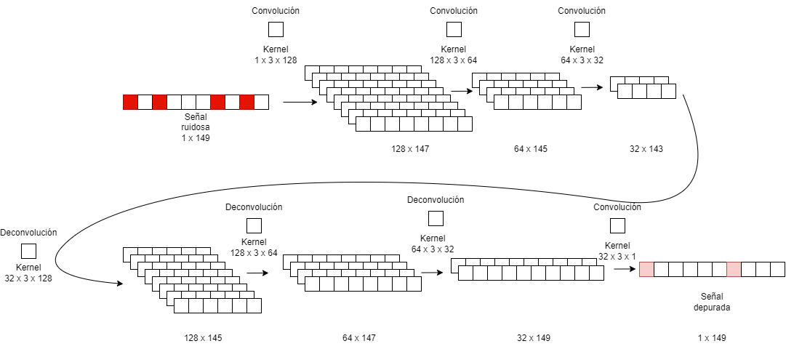

# Convolutional autoencoder for audio denoising

This repo contains model, data and paper to fully build, train and comprenhend how this neural network woks.

This approach takes the convolutional architechture widely used in image denoising as the different layers of an autoencoder network to denoise audio signlas contaminated with clicks. These anomalies arise due to the long term wear and tear in vinyl records caused by the diamond tip of the stylus. 

*Model diagram*

The paper includes a complete explanation on how the model works, how to generate the data sets needed to train/test the network and several results showing the model's effectivity. It is written in Spanish.

*Some of the denoised signals compared to the originals and their noisy counterparts*
